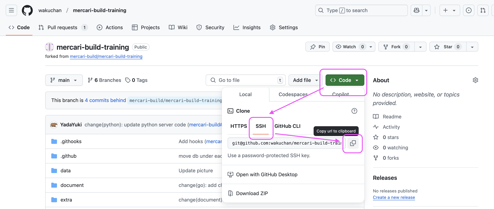
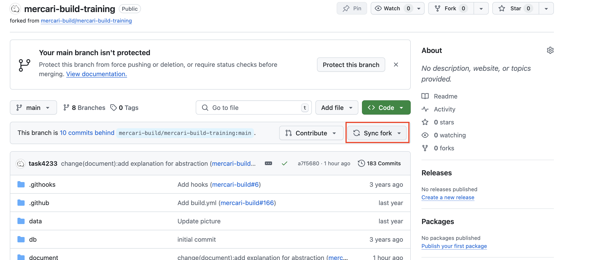
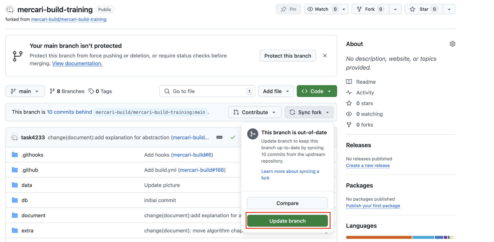

# STEP1: Git

In this step, we will learn how to use Git and GitHub.

**:book: Reference**

* (JA)[Gitを使ったバージョン管理](https://backlog.com/ja/git-tutorial/intro/01/)
* (JA)[Udemy Business - Git：はじめてのGitとGitHub](https://mercari.udemy.com/course/intro_git/)
* (EN)[Git basics](https://www.atlassian.com/git)
* (EN)[Udemy Business - GitHub Ultimate: Master Git and GitHub - Beginner to Expert](https://mercari.udemy.com/course/github-ultimate/)


## Fork this **mercari-build-training** repository

* Fork [mercari-build-training](https://github.com/mercari-build/mercari-build-training) 
* You will see be able to see `https://github.com/<your github id>/mercari-build-training` if successful.


## Install Git
1. Install git in your environment and run the following command.
   ```shell
   $ git version
   ```
   
   * For Mac users: Install [brew](https://brew.sh/) and `brew install git`
   * For Windows users: Download [installer](https://gitforwindows.org/)
   
2. Set your name and email address using git config. Check if your email address shows up.
   ```shell
   $ git config --global user.name "<your name>"
   $ git config --global user.email "<your-email-address>"
   $ git config user.email
   <your-email-address>
   ```

## Use basic commands in Git
0. Follow the GitHub documentation to setup SSH-key.
- [Generate new SSH key](https://docs.github.com/en/authentication/connecting-to-github-with-ssh/generating-a-new-ssh-key-and-adding-it-to-the-ssh-agent?platform=mac)
- [Add a new SSH key](https://docs.github.com/en/authentication/connecting-to-github-with-ssh/adding-a-new-ssh-key-to-your-github-account)


1. **Clone** `https://github.com/<your github id>/mercari-build-training` onto your local using the following command. Follow the below image to get the ssh url. 

   ```shell
   $ cd <your working space>
   $ git clone git@github.com:<your github id>/mercari-build-training.git
   ```

**:bangbang: Caution**

Please definitely run the following command after cloning repository. 
```
cd mercari-build-training
git config --local core.hooksPath .githooks/ 
```
This is required to use githooks in mercari-build-training repository.

2. Make a new branch named `first-pull-request` and **switch** into this branch
   ```shell
   $ cd <your working space>/mercari-build-training
   $ git branch first-pull-request
   $ git switch first-pull-request
   ```
3. Replace `@your_github_id` on README.md with your GitHub ID.
4. **commit** the changes you made with the following commands.
   ```shell
   $ git status # Check your change
   $ git add README.md # Add README.md file to the list of files to commit
   $ git commit -m "Update github id" # Brief description about the changes
   ```
5. **push** changes to GitHub.
   ```shell
   $ git push origin first-pull-request:first-pull-request
   ```
6. Open `https://github.com/<your github id>/mercari-build-training` and make a **Pull Request** (PR).
    - base repository: `<your github id>/mercari-build-training`
    - base branch: `main`
    - target branch: `first-pull-request`

## Review a PR and have your PR reviewed
- Once you made a PR, ask a teammate for review.
- If at least one person `approve`s the PR, `merge` into the main branch
- Open your teammates' PRs and check the files changed, and `approve` if you think the changes look good.
---

**:book: Reference**
- [How to do a code review](https://google.github.io/eng-practices/review/reviewer/)


**:beginner: Points**

Check if you understand the following concepts.

- branch
- commit
- add
- pull, push
- Pull Request

---

## Pull the latest changes

When the original repository is updated, you have to pull the changes into your forked repository as well.

1. Update your forked repository

Please open `https://github.com/<your github id>/mercari-build-training` in your browser, please update your repository as follows:





2. Update your local environment

```bash
git fetch origin
git merge origin/main
```


### Next

[STEP2: Building local environment](02-local-env.en.md)
