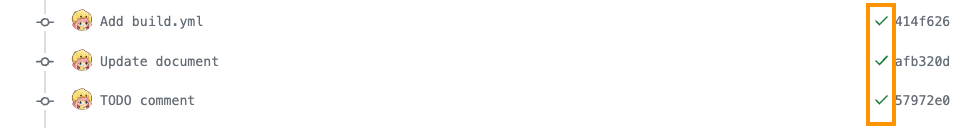

# STEP5: CIを使ってDocker imageをBuildする

このステップでは CI の使い方を学びます。
**:book: Reference**
* [継続的インテグレーションについて](https://docs.github.com/ja/actions/automating-builds-and-tests/about-continuous-integration)
* [Udemy - GitHub Actionsで学ぶCI/CD入門―ビルド・デプロイの基本からAPI自動テスト・AWSへの自動デプロイまで
](https://www.udemy.com/course/cicd-with-github-actions/)

## 1. CIを理解する
CIとはContinuous Integration（継続的インテグレーション）の略語で、
コードをpushしたりmergeしたりするたびに自動的にビルドやテストなどを行うプロセスです。
一人で開発していると使う機会がない方も多いと思います。

まずはReferenceにあるページやUdemyを参考に、CIについて勉強しましょう。

## 2. Github Actionsを有効にする
GithubはGithub Actionsと呼ばれるCIサービスを提供しています。
まずは皆さんのリポジトリでGithub Actionを有効化します。

- [ワークフローの有効化](https://docs.github.com/ja/actions/managing-workflow-runs/disabling-and-enabling-a-workflow)

有効にしたら、適当なcommitを作成し、PushをトリガーにGithub Actionsのワークフローが動くことを確認します。
以下の図のように:white_check_mark:や:red_circle:がcommit commentの横に表示されていれば動いています。


## 3. アプリケーションをGithubActionsでビルドして、docker imageをregistryにupする
`.github/workflows/build.yml`にregistryにあなたのコードをpushするフローが書かれているので、

```yaml 
#    - name: Build and push Docker image
```
のStepのコメントアウトを外し、CI経由でdocker imageをpushさせてみましょう。

うまくいくと `ghcr.io/<github-id>/mercari-build-training-2023:<branch-name>` 
というURLにimageがpushされるので、ローカルでそのimageをpullして実行してみましょう。

Reference
- [GitHub Actionsでのパッケージの公開とインストール](https://docs.github.com/ja/packages/managing-github-packages-using-github-actions-workflows/publishing-and-installing-a-package-with-github-actions#upgrading-a-workflow-that-accesses-a-registry-using-a-personal-access-token)
