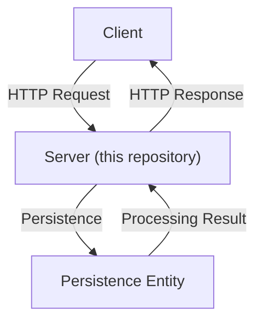

# app

[JA](./README.md)

The app package provides application such as the server, API handlers, and mechanisms for persistence.

The server provided by this package receives HTTP requests from the client and returns the results to the user.



The files and responsibilities included in this package are as follows. Please add files or modify responsibilities as needed.

```bash
├── README.en.md
├── README.md
├── middleware.go       # Responsible for general server-side processing
├── mock_infra.go       # Mock for persistence
├── infra.go            # Responsible for persistence-related processing
├── server.go           # Responsible for handling HTTP requests/responses and managing handler logic
└── server_test.go      # Responsible for testing the logic included in server
```

