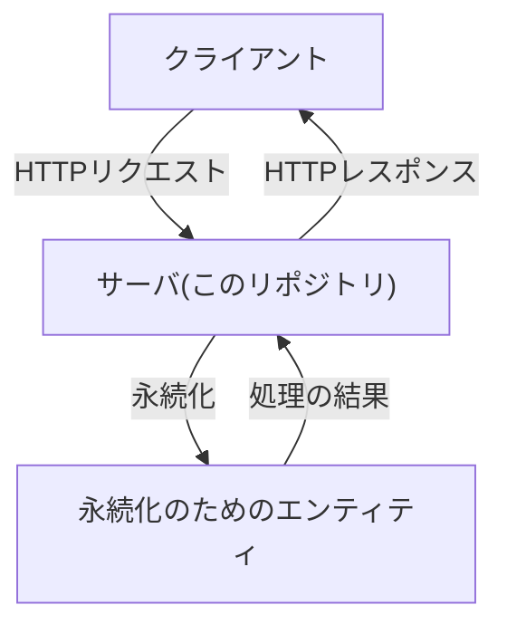

# app

[EN](./README.en.md)

appパッケージは、サーバ、APIのハンドラ、永続化のための仕組み等のアプリケーションの機能を提供します。

クライアントからのHTTPリクエストをこのパッケージが提供するサーバが受け取り、結果をユーザに返却します。



このパッケージに含まれるファイルと責務は以下の通りです。必要に応じてファイルを追加したり、責務を変更したりしてください。

```bash
├── README.en.md
├── README.md
├── middleware.go       # サーバの汎用的な処理が責務
├── mock_infra.go       # 永続化のモック
├── infra.go            # 永続化のための処理が責務
├── server.go           # HTTPリクエスト/レスポンス等のハンドリング、ハンドラのロジック管理が責務
└── server_test.go      # server.goに含まれる処理のテストが責務
```

